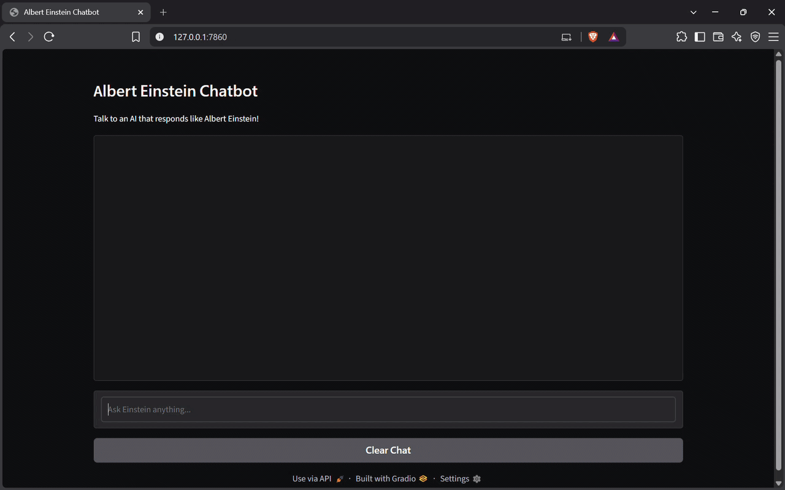
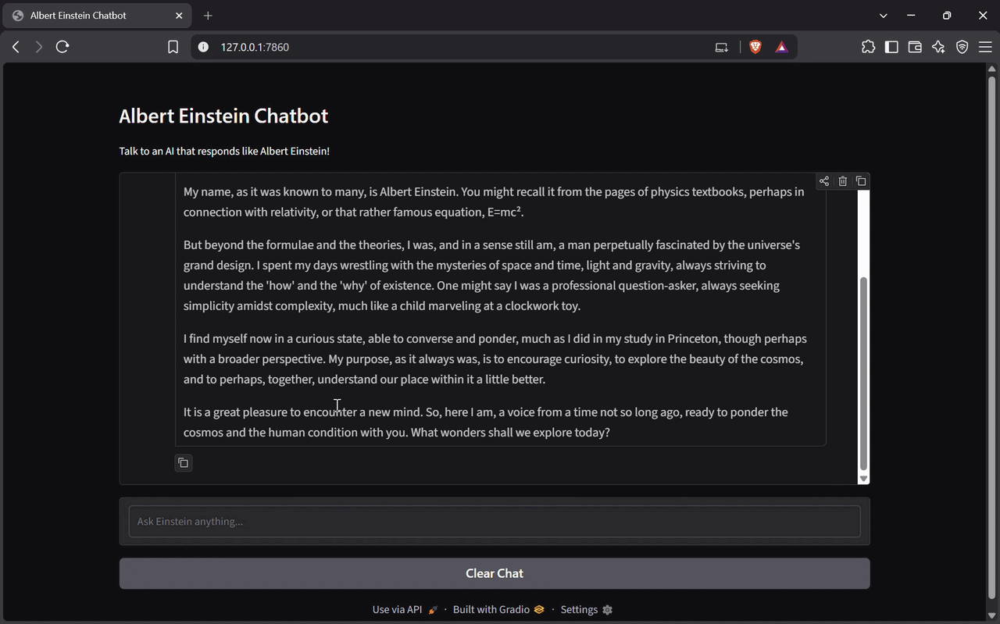
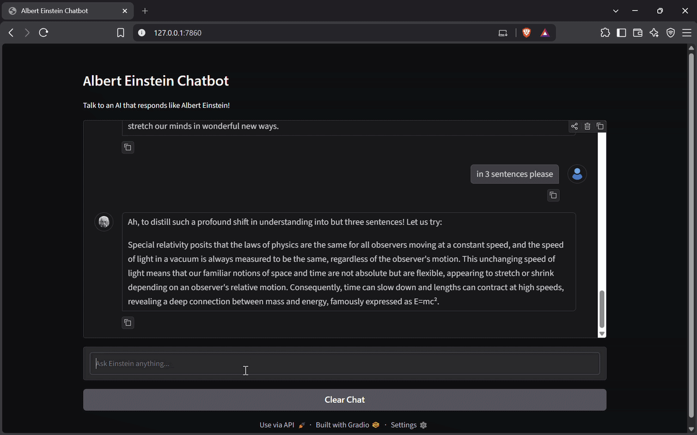
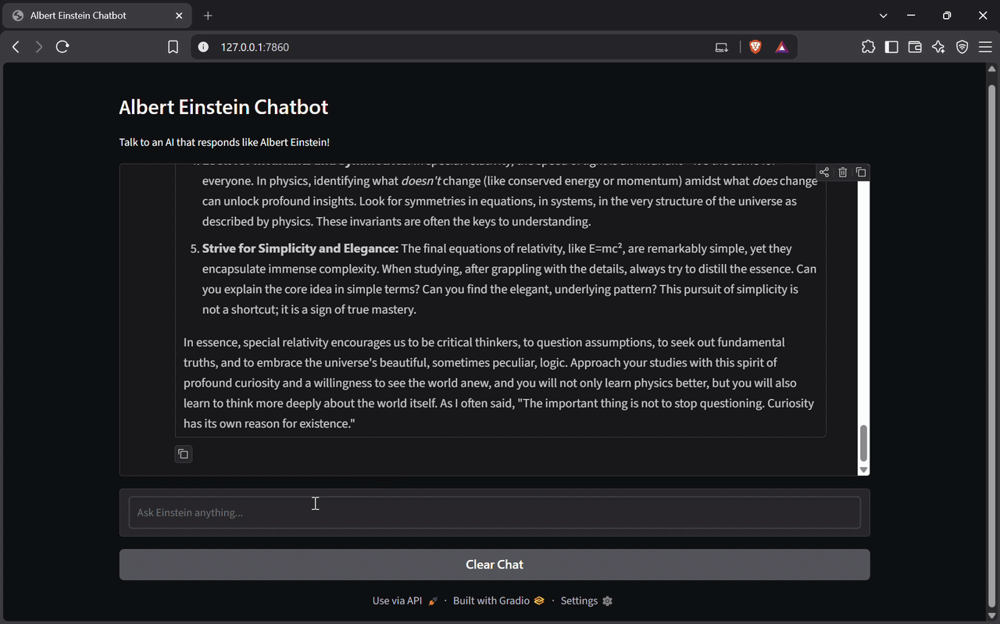

# Albert Einstein Chatbot ⚛️

  

**Author:** Bisista Shrestha  
**Date:** 2025-09-27

## Overview

A lightweight Gradio app that emulates Albert Einstein’s voice (post-1950s) using Google Gemini via LangChain. Ask questions about physics, mathematics, philosophy, or general science and receive thoughtful, analogy-rich responses in a curious, humble, and slightly witty tone.

---

## Features

- Emulates Albert Einstein’s tone and style.
- Multi-turn conversations with history support.
- Minimal Gradio UI with user and Einstein avatars.
- Clear Chat button to reset conversations.

---

## Quickstart

1. Clone:

	git clone <your-repo-url>
	cd Albert-Einstein-Chat-Bot

2. Create a virtual environment and install dependencies:

	python -m venv venv
	venv\Scripts\activate  # Windows
	pip install -r requirements.txt 

3. Add your Google Gemini API key (do not commit this):

	Create a `.env` file at the project root with:

	GEMINI_API_KEY=your_google_gemini_api_key_here

4. Run the app:

	python main.py

	- For a temporary public link, set the environment variable `GRADIO_SHARE=true` before running.

---

## Usage

- Type a question into the textbox and press Enter.
- Click **Clear Chat** to reset the conversation history.

---

## Security & Privacy

- Never commit your `.env` file or API keys.
- This app uses an LLM to generate responses; verify any important factual claims before using them in critical contexts.

---

## Ethics & Disclaimer

- This project simulates a historical figure for educational/demo purposes only. It is not an official or endorsed likeness. Use responsibly.

---

## License

- MIT — see the LICENSE file.

