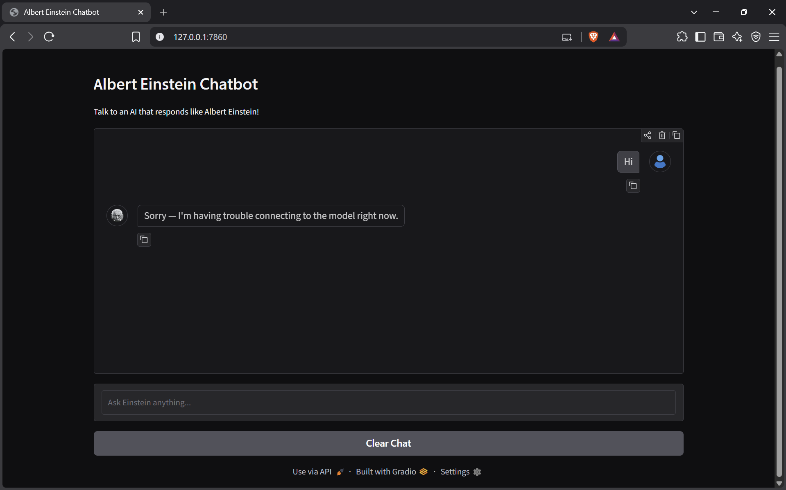

# Albert Einstein Chatbot ⚛️

[](https://www.python.org/) [](LICENSE) [](https://gradio.app/) [](https://ai.google.dev/)

**Author:** Bisista Shrestha  
**Date:** 2025-09-27

|  |
|:--:|
| *Demo Preview — "Who are you?"* |

---

## Overview

A lightweight Gradio app that emulates Albert Einstein's voice (post-1950s era) using **Google Gemini 2.5 Flash** via **LangChain**. Ask questions about physics, mathematics, philosophy, or general science and receive thoughtful, analogy-rich responses in a curious, humble, and slightly witty tone.

---

## Features

- 🧠 Emulates Albert Einstein's tone, personality, and style.
- 💬 Multi-turn conversations with chat history support (last 6 exchanges).
- 🖼️ Minimal Gradio UI with custom user and Einstein avatars.
- 🔁 Clear Chat button to reset the conversation.
- 🌐 Optional public sharing link via `GRADIO_SHARE=true`.

---

## Tech Stack

| Component | Details |
|-----------|---------|
| Language  | Python 3.12 |
| LLM       | Google Gemini 2.5 Flash |
| Framework | LangChain (`langchain-google-genai`) |
| UI        | Gradio |
| Config    | python-dotenv |

---

## Quickstart

### 1. Clone the repository

```bash
git clone <your-repo-url>
cd Albert-Einstein-Chat-Bot-clean
```

### 2. Create a virtual environment and install dependencies

```bash
python -m venv venv

# Windows
venv\Scripts\activate

# macOS / Linux
source venv/bin/activate

pip install -r requirements.txt
```

### 3. Set up your Google Gemini API key

Create a `.env` file at the project root (do **not** commit this file):

```env
GEMINI_API_KEY=your_google_gemini_api_key_here
```

> You can obtain a free API key at [https://aistudio.google.com/app/apikey](https://aistudio.google.com/app/apikey).

### 4. Run the app

```bash
python main.py
```

To expose a temporary public link:

```bash
# Windows (PowerShell)
$env:GRADIO_SHARE="true"; python main.py

# macOS / Linux
GRADIO_SHARE=true python main.py
```

The app will open at `http://127.0.0.1:7860` by default.

---

## Usage

- Type a question into the textbox and press **Enter**.
- Click **Clear Chat** to reset the conversation history.
- The chatbot keeps track of the last **6 exchanges** (12 messages) to provide contextual replies.

---

## Project Structure

```
Albert-Einstein-Chat-Bot-clean/
├── assets/              # Images and GIF demos
│   ├── einstein.png
│   ├── user.png
│   └── ...
├── main.py              # Main application entry point
├── requirements.txt     # Python dependencies
├── .env                 # API key (not committed)
├── .gitignore
└── readme.md
```

---

## Security & Privacy

- **Never commit** your `.env` file or API keys to version control (`.gitignore` already excludes it).
- This app uses an LLM to generate responses — verify any important factual claims before relying on them in critical contexts.

---

## Ethics & Disclaimer

This project simulates a historical figure for **educational and demonstration purposes only**. It is not an official, endorsed, or affiliated likeness of Albert Einstein or the Hebrew University of Jerusalem (which manages Einstein's estate). Use responsibly.

---

## License

MIT — see the [LICENSE](LICENSE) file for details.

---

## 🎬 Full Demo

| *👉 [Watch the full Demo Here (YouTube)](https://youtu.be/QcEt5xwcRi4)* |
|:--:|
|  |
| *Sir Einstein Needed a Break~* |

